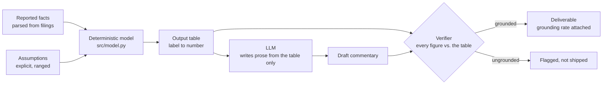
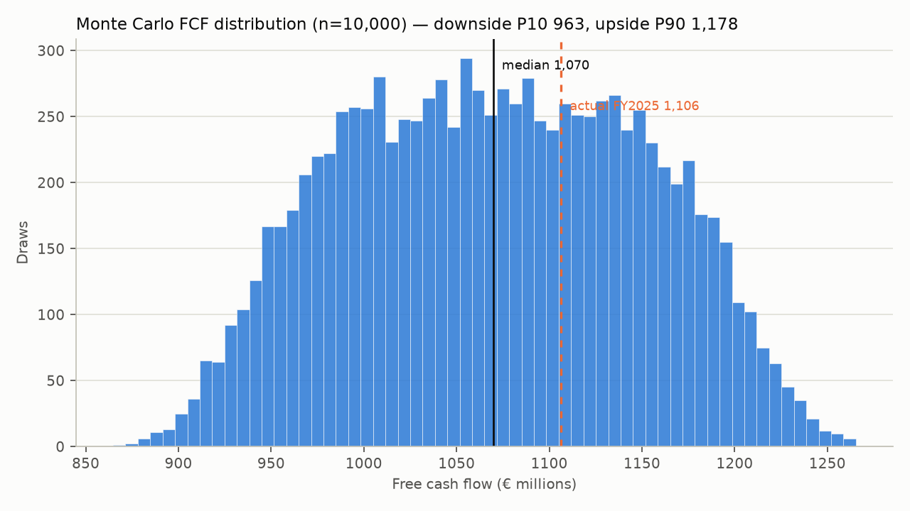
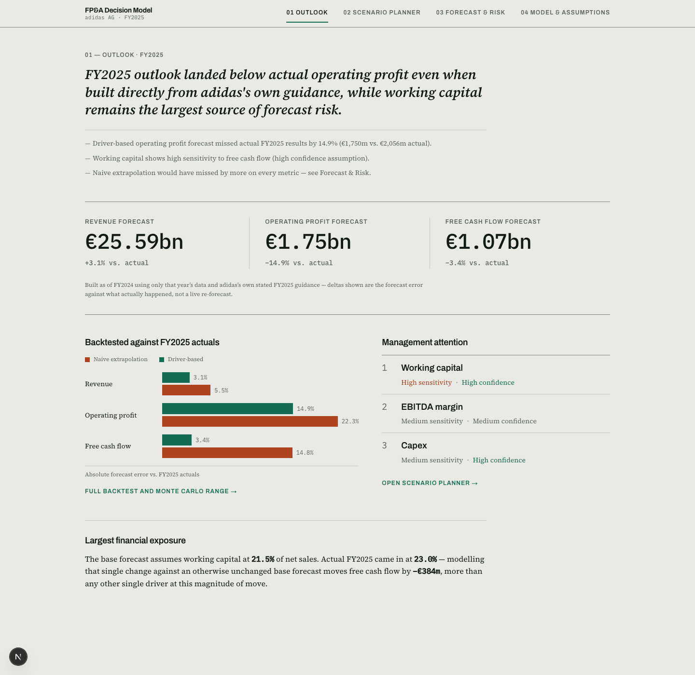
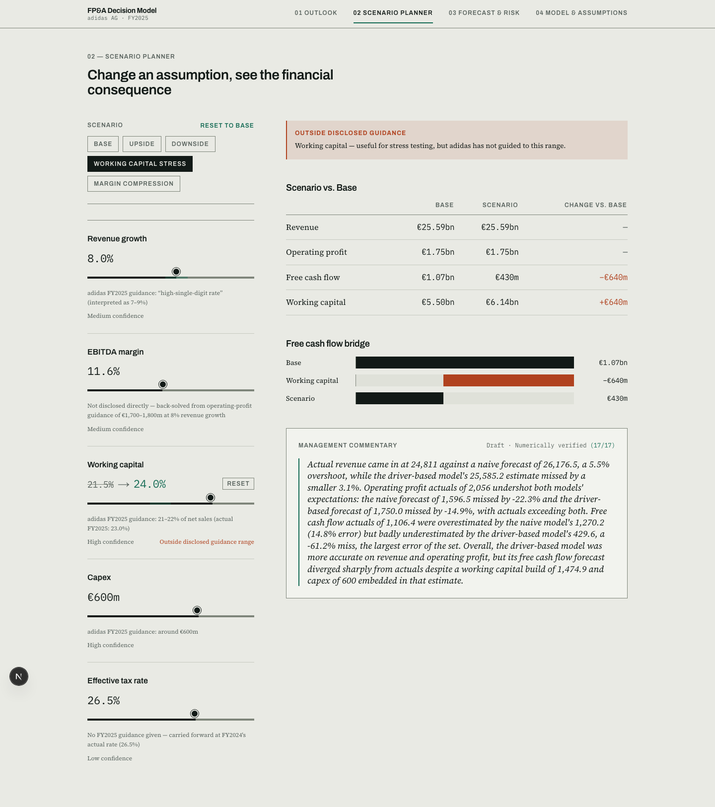

# FP&A Decision Model

[](https://github.com/morichtereur/fpa-decision-model/actions/workflows/test.yml)

**Can a driver-based FP&A model beat a naive top-down forecast, checked against what actually happened?**

FP&A models often look precise while hiding the assumptions that actually
drive the answer. This project separates reported facts, planning
assumptions and calculated outputs, then traces channel and category growth
through to EBITDA and free cash flow for one real company — rather than
presenting a forecast as if it were a measurement.

**[▶ Open the live cockpit](https://fpa-decision-model.vercel.app/planner)** — drag
the working-capital slider and watch the free-cash-flow bridge move. That one
interaction is the finding below.

## The guardrail: getting LLM prose into a deliverable that carries numbers

The reusable part of this repository is not the adidas forecast. It is the
pattern that lets generated text into a document a client acts on.

The problem is generic: an LLM asked to narrate a financial result will
produce fluent prose containing figures that were never calculated, and
nobody reading the paragraph can tell which is which. Prompting harder does
not fix it, because the failure is unobservable at the point of use.

The architecture inverts the usual order. The model never sees source
documents and never computes anything: a deterministic Python model produces
a flat table of calculated outputs, the LLM is given only that table and told
to introduce no number outside it, and every numeric claim in the returned
prose is then extracted and checked back against the table it was written
from. Generation is untrusted by construction; the check is the contract.



It transfers because nothing in it is about finance. Any domain where a
calculation exists and prose must describe it — actuarial results, clinical
readouts, regulatory reporting, cost models — has the same shape: a trusted
computation, an untrusted narrator, and a check between them.

It also does not depend on a vendor. Generation sits behind
`src/provider.py`, whose whole contract is a system prompt, a user prompt and
text back — the common denominator across the Anthropic API, Bedrock, Vertex
and OpenAI-compatible endpoints. Two are implemented: the Anthropic API
directly, and Amazon Bedrock through its OpenAI-compatible endpoint. Switching
is `LLM_PROVIDER=bedrock` in `.env` and nothing else, and each provider carries
its own default model id — a model name is only meaningful relative to the
endpoint that serves it. The forecast never calls a model at all, so none of
the numbers depend on that choice.

Every stored commentary records the provider, model and token usage that
produced it. Generated financial prose without that attribution cannot be
checked later against the vendor it is supposed to have come from.

The Bedrock model was picked by measurement rather than by name. Running the
same prompt across the endpoint's catalogue and scoring each output with this
repository's own two verifiers, the obvious first choice —
`openai.gpt-oss-120b` — turned out to be unusable: it ignores the length and
format constraints and computes figures the prompt forbids it to compute,
inventing several that are in no table. `nvidia.nemotron-super-3-120b`
returned plain prose at a 1.0 grounding rate with no coherence findings, and
is the default. That is the guardrail earning its keep in an unglamorous way:
not catching a hallucination in production, but disqualifying a model before
it got there.

### What the guardrail does not catch

A grounding rate measures the model. `eval/eval_verifier.py` measures the
guardrail, by feeding it commentary whose numbers are known to be wrong
(`make eval-verifier`, no API calls, runs in CI):

| attack | caught |
|---|---|
| Free invention, unrelated to the model | 85% |
| Order-of-magnitude error (×10, ÷10) | 90% |
| **Near-miss: a real value drifted 1–4%** | **0%** |
| **Cross-metric: a real value under the wrong metric's name** | **0%** |
| Control: correctly quoted values | 100% accepted, no false positives |

Both blind spots are structural rather than tuning problems, and the second
is the more serious. Anything inside the relative tolerance is invisible by
construction — so the layer is strongest against wild invention, which is not
how models fail, and blind to drift, which is. And because the verifier
compares numbers against the whole table without ever seeing which label a
claim attached them to, a correct figure reported as the wrong metric passes
every check. That is not hypothetical: it is exactly how a stress scenario in
this repository came to be described as the driver-based forecast with every
number in the sentence real.

### The second layer: is the number used correctly?

Grounding asks whether a figure exists in the table. `src/claims.py` asks
whether the sentence built from it says something the table supports —
deterministically, sentence by sentence, with no second model involved. Three
checks, each written against a failure the published output actually
contained:

| check | what it catches |
|---|---|
| `direction` | a comparison whose arithmetic contradicts its verb |
| `comparison_base` | a forecast error re-labelled as an outperformance |
| `attribution` | a real value quoted under a metric it does not belong to |

Run against the five preset paragraphs that were committed to this repository
— every one of them scoring a grounding rate of 1.0 — it returns **seven
findings across three of them**. The clearest:

> "actual results of 2,056 fell short of the driver-based forecast of 1,750.0
> by 14.9 percent"

2,056 is larger than 1,750. Both figures are real, so grounding passes; the
sentence states the central finding of this project backwards.

The second check is the one worth understanding, because the cause was the
prompt rather than the model. The table stores `*_error_pct` as
(forecast − actual) / actual — the forecast's error, measured against actual.
The outperformance of actual over that forecast has a different denominator
and is always the larger number. Since the prompt forbids computing anything,
a model asked to describe a beat has no correct figure available and reaches
for the nearest one, producing "beating it by 22.3%" where the answer is
28.8%. The rule meant to prevent invention was manufacturing a specific,
repeatable error. The prompt now pins the framing to what the table actually
supports.

`make commentary` is a gate rather than a report: a paragraph that fails
either check is not written, and the command exits non-zero.

That leaves near-miss drift, where a tolerance is a poor instrument, open and
stated here rather than discovered by a reader.

## Decision implication

For a CFO the useful output is not the forecast, it is where to spend review
time. Free cash flow correlates −0.92 with the working-capital assumption and
−0.19 with revenue growth, so the quarterly argument about the growth rate —
the one that fills the room — is the input that moves the answer least. The
naive forecast's largest miss came from precisely the assumption nobody
debated: it held working capital flat while it rose from 19.7% to 23.0% of
sales.

That reframes the planning cycle rather than improving it at the margin.
Growth is the number with the most opinions attached and the least leverage;
working capital is the reverse. A review built on this evidence opens on
payment terms, inventory and collection, and carries the growth assumption as
a range rather than negotiating it as a figure.

## Key finding

**Yes, on every metric — but both forecasts still missed by a lot, because adidas beat its own guidance.** Built as of FY2024 using only that year's data and adidas's own stated FY2025 outlook, the driver-based model's error was smaller than a naive extrapolation's on revenue (3.1% vs. 5.5%), operating profit (14.9% vs. 22.3%) and free cash flow (3.4% vs. 14.8%). Both undershot actual FY2025 operating profit — adidas guided €1.7-1.8bn and delivered €2,056m — so "the driver-based model won" is not the same claim as "the driver-based model was accurate."

| metric | naive error | driver-based error |
|---|---|---|
| revenue | 5.5% | 3.1% |
| operating profit | 22.3% | 14.9% |
| free cash flow | 14.8% | 3.4% |

**The dominant source of forecast uncertainty is working capital, not growth.** A Monte Carlo run over adidas's own disclosed FY2025 guidance ranges (not invented historical volatility — three fiscal years is too few to estimate that honestly) shows free cash flow correlates with working-capital assumptions at -0.92, versus -0.19 for revenue growth. The naive method's biggest miss was exactly this: it held working capital % of sales flat at FY2024's level, but it rose from 19.7% to 23.0% in FY2025 — a real cash drag a growth-only extrapolation cannot see.

**One data-quality finding along the way:** adidas's FY2025 report restates FY2024's product-division mix — Accessories goes from €1,499m as originally reported to €1,779m restated, a ~19% gap ("reclassification within the product divisions," per the report's own footnote). Group-level financials (net sales, EBITDA, operating profit) are *not* restated, only the segment split is — a distinction the model has to preserve rather than flatten into one "2024" number.



Full generated readout: [`RESULTS.md`](RESULTS.md) — regenerated by
`make report` after any change to the model, never hand-edited.

This is one backtest point, not a track record; see "What this is not" below.

## Interactive FP&A Decision Cockpit



Change the underlying forecast assumptions and trace their effect through
operating profit, working capital and free cash flow. Four views — Outlook,
Scenario Planner, Forecast & Risk, Model & Assumptions — over the same
model this README describes; nothing in the interface computes a number
the Python model doesn't.



The Scenario Planner is the point of the exercise: five drivers, each
shown with its baseline, its source, its confidence, and whether the
current value sits outside adidas's own disclosed guidance range. Moving
one recalculates revenue, operating profit, working capital and free cash
flow immediately, shows the change as a baseline → adjusted delta and a
free-cash-flow bridge, and — on request, not automatically — a grounded
management commentary generated from that scenario's own output table.

**Why Next.js + FastAPI, not Streamlit:** the visual and interaction bar
here (bespoke typography, a custom-drawn slider with a guidance-range
overlay, a waterfall bridge, no default-Streamlit chrome) is exactly where
Streamlit fights you — more effort goes into suppressing its defaults than
into the product. FastAPI exposes the existing `src/` model as JSON; it
adds no forecasting logic of its own. The Next.js frontend reuses the same
design tokens (color, type, spacing) as
[morichtereur.github.io](https://morichtereur.github.io), so the cockpit
reads as part of one portfolio rather than a one-off UI experiment.

**Reproducibility is enforced, not assumed:** `tests/test_drivers.py`
checks that the planner's Base case reproduces `src/backtest.driver_based()`
exactly, and `tests/test_api.py` cross-checks every scenario the API can
return against a direct `src/model.forecast()` call. The UI is an
interface to the model, not a second model.

### Run the cockpit

```bash
make api                          # FastAPI on :8000 — the model, as JSON
cd web && cp .env.local.example .env.local && npm install && npm run dev   # Next.js on :3000
```

### Deploy it

Two Vercel projects from this one repository.

**API** — a new project with **Root Directory** left at the repo root.
`vercel.json` builds `api/index.py` as a Python serverless function and
routes every `/api/*` request into the FastAPI app. Set `CORS_ORIGINS` to
the frontend's origin once it exists.

**Frontend** — a second project with **Root Directory** set to `web`.
Next.js is detected without further configuration. Set
`NEXT_PUBLIC_API_BASE` to the API project's URL.

Serverless rather than a long-running host on purpose: free container tiers
sleep after minutes of inactivity and answer the next visitor after a
30-60s cold start, which is worse than no demo. `render.yaml` is kept as a
fallback if the serverless route needs more fighting than it is worth.

The function installs `api/requirements.txt`, which is deliberately smaller
than the repo's: matplotlib belongs to `src/report.py`, pypdf to
`src/extract.py`, and the Anthropic SDK is imported inside
`commentary.write()` rather than at module scope — so a bundle that never
plots, parses a PDF or calls an LLM does not carry any of them.

Three of the four routes are server-rendered on demand, since they read the
model at request time — so the frontend needs a Node runtime rather than a
static export.

**No `ANTHROPIC_API_KEY` on either host.** Preset commentary is served from
the committed `data/commentary.json` and works without one;
`/api/commentary/live` returns a 503 with a clear message rather than
exposing a billable endpoint to the open internet. Live commentary stays a
local-development feature.

Verified end to end against a production build locally — `next build` +
`next start` against the API, presets recomputing through `POST
/api/scenario`. The hosted deployment itself is one connect step on each
platform.

## The company

**adidas AG**, using its FY2024 and FY2025 annual reports (not part of the
[dax-intelligence](https://github.com/morichtereur/dax-intelligence)
corpus — sourced separately; see `data/raw/README.md` for download links).

adidas doesn't disclose a price/volume bridge. What it discloses,
consistently, is currency-neutral revenue growth broken down by **product
division** (Footwear, Apparel, Accessories) and **channel** (Wholesale,
Direct-to-Consumer), with FX visible only as the gap between reported and
currency-neutral growth. That's a real constraint, not an oversight: the
model's driver granularity is bounded by what the company actually
discloses.

## Method

**Data → model → result → decision implication → evaluation**

1. **Facts** (`src/extract.py`) — net sales, EBITDA, operating profit,
   margins, working capital %, capex, product-division and channel splits,
   and adidas's own FY2025 guidance, parsed out of the two source PDFs into
   `data/facts/adidas_drivers.json`. Both the originally-reported and
   later-restated versions of FY2024 are kept, tagged by source — never
   silently overwritten.
2. **Model** (`src/model.py`) — a driver-based forecast: per-division
   revenue growth, an EBITDA margin assumption, a working-capital % and a
   capex figure, traced through D&A, tax and the change in working capital
   to free cash flow. adidas doesn't report FCF directly — it's derived as
   NOPAT + D&A − ΔWC − capex, a modeling choice stated here, not presented
   as if adidas disclosed it.
3. **Backtest** (`src/backtest.py`) — the naive extrapolation (FY2023→FY2024
   growth rate continued, margins held flat) versus the driver-based
   forecast (FY2024 data + adidas's stated FY2025 guidance), both checked
   against FY2025 actuals. See Key finding above.
4. **Scenario** (`src/scenario.py`) — Monte Carlo over adidas's own
   disclosed guidance ranges (not historical volatility — see Key finding).
   Reports which assumption's variance explains the most FCF variance.
5. **Commentary** (`src/commentary.py`) — an LLM writes management
   commentary from the backtest's output table only, never from raw source
   text. Each series in that table is prefixed with its own name, so a
   scenario is described as that scenario: tabling a stress case under
   `driver_based_*` once produced commentary calling a −61.2% free-cash-flow
   miss "the driver-based model", on a page where the backtest reports that
   model's error as 3.4%. Every number it states is regex-extracted and checked back
   against that table; a live run scored a 100% grounding rate (15/15
   claims), reported alongside the forecast rather than assumed.
6. **Report** (`src/report.py`) — writes `RESULTS.md` and the Monte Carlo
   chart above from the backtest and scenario outputs. Generated, not
   hand-edited, so its claims always match the last run.

## Stack

`Python` · `NumPy` · `pypdf` · `LLM API` · `pytest` · `FastAPI` · `Next.js` · `TypeScript`

## Repository map

| path | responsibility |
|---|---|
| `src/config.py` | company/fiscal-year scope, paths, env vars |
| `src/extract.py` | parse financials, division/channel splits and guidance out of the source PDFs |
| `src/model.py` | driver-based forecast: facts + assumptions → EBITDA/FCF |
| `src/backtest.py` | driver-based vs. naive forecast, checked against actuals |
| `src/scenario.py` | Monte Carlo over adidas's disclosed guidance ranges |
| `src/drivers.py` | single source of truth for the cockpit's 5 driver controls (default, range, guidance, confidence) |
| `src/commentary.py` | grounded LLM commentary + numeric verification |
| `src/report.py` | generates `RESULTS.md` and `data/monte_carlo_fcf.png` |
| `api/` | FastAPI layer exposing the model as JSON — no forecasting logic of its own |
| `web/` | Next.js Interactive FP&A Decision Cockpit (4 views) |
| `data/raw/` | source PDFs (not committed — see `data/raw/README.md`) |
| `data/facts/adidas_drivers.json` | extracted, structured driver data (committed — small, fully derived) |
| `RESULTS.md` | generated readout (committed — never hand-edited) |
| `tests/` | extraction, model, backtest, scenario, grounding, report and API-reproducibility checks |

## Run it

```bash
python3 -m venv .venv && source .venv/bin/activate
make install
make test                 # extraction/backtest/scenario tests skip gracefully without the PDFs

cp .env.example .env      # Anthropic key, needed only for src/commentary.py
# place the two Adidas PDFs in data/raw/ — see data/raw/README.md
make extract               # -> data/facts/adidas_drivers.json
make backtest               # -> naive vs. driver-based forecast, checked against actuals
make scenario               # -> Monte Carlo + sensitivity ranking
make report                 # -> RESULTS.md + data/monte_carlo_fcf.png
python -m src.commentary    # -> grounded management commentary (needs .env)
```

## What this is not

- **A multi-company benchmark.** One company, two driver dimensions
  (product division, channel), three fiscal years — depth over breadth,
  matching the rest of this portfolio.
- **A price/volume analysis.** adidas doesn't disclose that split; see
  "The company" above. Product division and channel growth are the real
  drivers used here, not a proxy for price/volume.
- **A track record.** One backtest point (FY2024 → FY2025). A single win
  is not evidence the driver-based approach generalizes; it's evidence it
  beat one naive baseline once, on data available at the time.
- **A trading or investment signal.** This is a methodology exercise on
  public financial disclosures, not analysis intended to inform an
  investment decision.

---

Built by [Moritz Richter](https://www.linkedin.com/in/moritz-richter-28297119a/) · Finance & Strategy Consultant · Zürich
